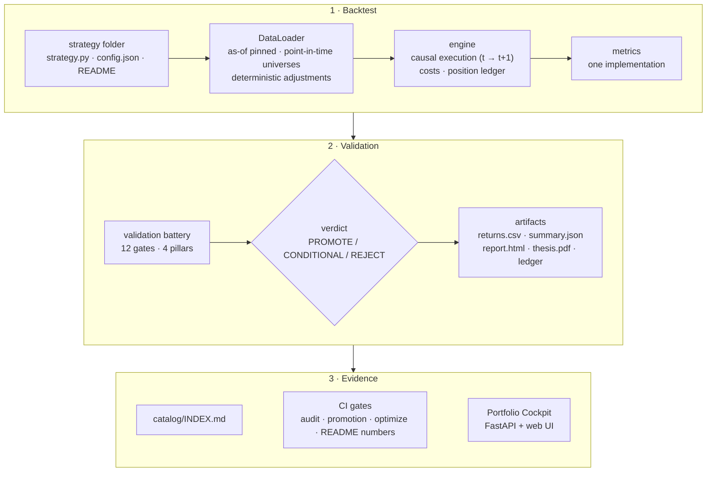
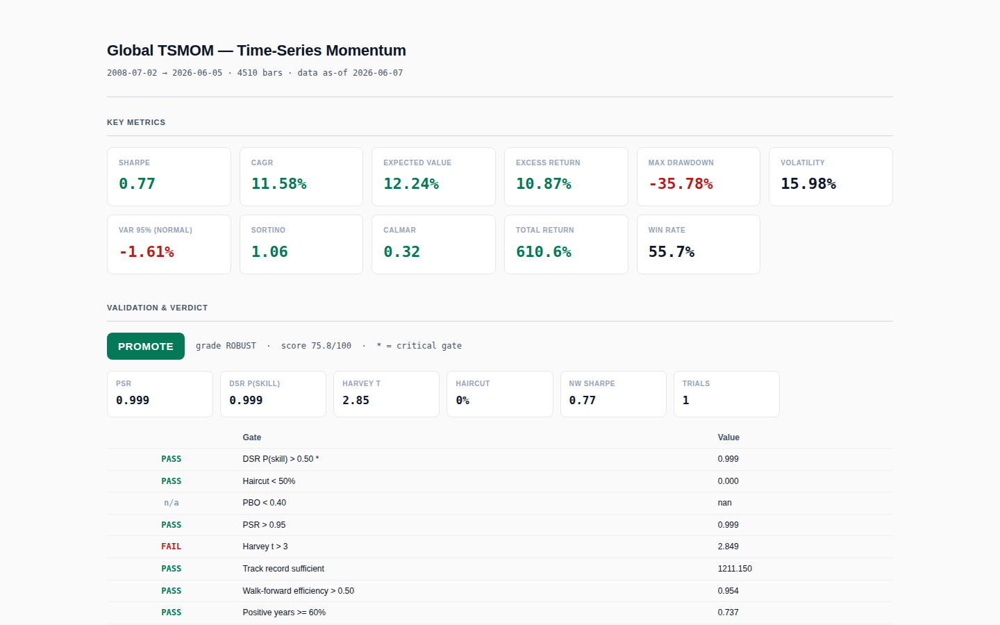
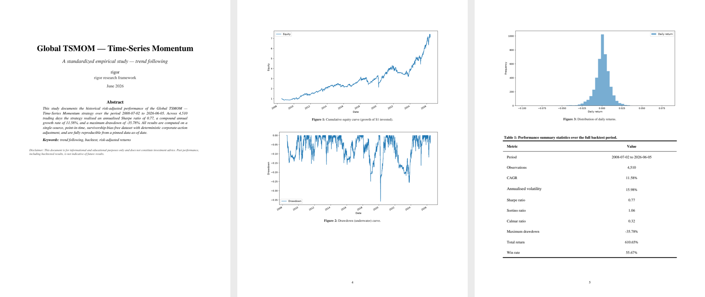
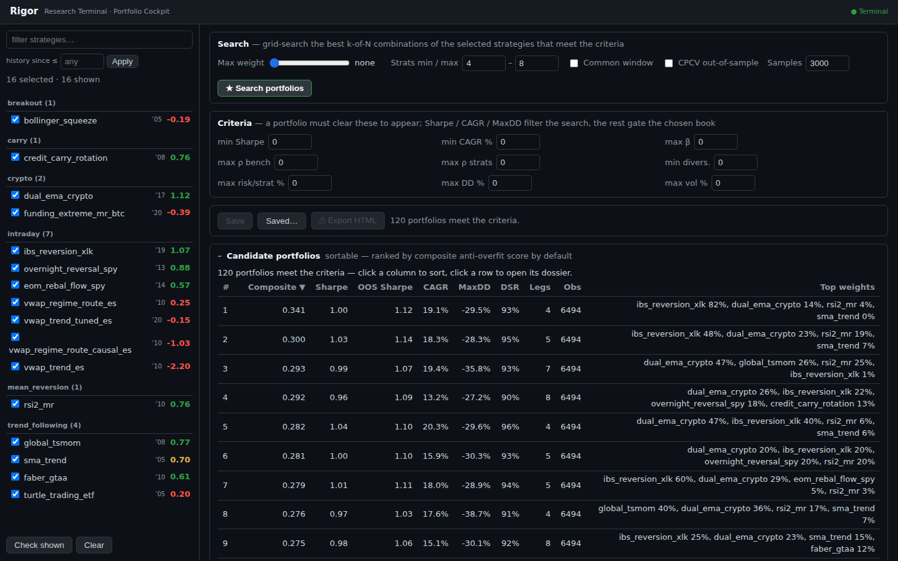

# rigor

**A reproducible research framework for systematic trading strategies.**
Every idea goes through the same pipeline — backtest, report card, research thesis and a
statistical verdict — and CI refuses any published number it cannot recompute.

[](https://github.com/Elias-outofsample/rigor/actions/workflows/ci.yml)


[](LICENSE)

Most backtests are optimistic by construction: try enough parameters and something will
look profitable. `rigor` exists to answer the question that matters before any capital is
involved — *is this edge real, or is it the best of many lucky draws?* A strategy is a
folder with a standard shape; one command turns it into a daily-returns series, a report
card, a PDF thesis and a verdict — **PROMOTE**, **CONDITIONAL** or **REJECT** — backed by
twelve statistical gates. The same pipeline, the same metrics and the same thresholds for
every strategy, reproducible from a pinned data date.

## Try it in 30 seconds — no data, no API key

```bash
git clone https://github.com/Elias-outofsample/rigor && cd rigor
pip install -e .
rigor demo
```

The demo runs a moving-average crossover on a **random walk** — a market where no edge can
exist — then lets the optimiser search 25 parameter combinations on the same noise:

```text
[2/3] Backtest with default parameters (fast 20 / slow 100)
      Sharpe +0.13  CAGR +0.7%  MaxDD -66.4%
      Verdict: REJECT (OVERFIT, score 26/100)

[3/3] Optimise: 25 parameter combinations on the same noise
      best in-sample Sharpe +0.38 (fast 50 / slow 100) vs default +0.13  <- looks like an improvement
      deflated Sharpe P(skill)      0.35   (needs > 0.50)
      CPCV prob. of overfitting     0.36
      White reality check p-value   0.46   (vs the default config)
      walk-forward: IS Sharpe +0.35 -> OOS +0.21, positive OOS folds 4/5
      Verdict on the winner: REJECT (score 26/100)

      The search found luck, not skill — nothing to adopt.
```

The search nearly triples the in-sample Sharpe, and a walk-forward test on its own would
even look encouraging (four positive folds out of five). The battery as a whole is not
fooled: once the Sharpe ratio is deflated for the number of trials and the winner is
tested against the rest of the grid, the "improvement" is indistinguishable from chance.
The demo also writes the report card and the PDF thesis of the tuned configuration.

## How it works



```bash
rigor new trend_following my_idea         # scaffold a conforming strategy folder
rigor validate strategies/trend_following/my_idea
rigor run strategies/trend_following/my_idea --as-of 2026-06-01    # needs an EODHD key
rigor optimize strategies/trend_following/my_idea --as-of 2026-06-01 --full
rigor audit                                # recompute every committed number
```

## The validation battery

Each backtest is graded on twelve gates grouped in four pillars. Two are critical: failing
either forces a REJECT whatever the score. Gates whose input is unavailable (for example
PBO when there is no parameter grid) are neutral and leave the denominator.

| Pillar | Gate | The question it answers |
|---|---|---|
| Overfitting | **Deflated Sharpe P(skill) > 0.5** *(critical)* | After correcting for how many configurations were tried, is the Sharpe still likely positive? (Bailey & López de Prado) |
| | Haircut < 50% | How much of the Sharpe survives a multiple-testing haircut? |
| | PBO < 0.40 | Probability of backtest overfitting from combinatorially purged cross-validation: does the in-sample winner tend to land in the bottom half out of sample? |
| Significance | PSR > 0.95 | Probabilistic Sharpe ratio: confidence that the true Sharpe exceeds zero, given skew and fat tails |
| | Harvey t > 3 | The higher bar for significance proposed for a field that has tested thousands of factors |
| | Track record sufficient | Is the history long enough for this Sharpe (minimum track record length)? |
| Temporal | Walk-forward efficiency > 0.5 | Does out-of-sample performance keep at least half of in-sample? |
| | Positive years ≥ 60% | Is the edge spread over time, or one lucky period? |
| | Sub-period Sharpe CV < 0.5 | Is the Sharpe stable across sub-periods? |
| Viability | **Sharpe > 0** *(critical)* | Does it make money at all, after costs? |
| | Worst-year Sharpe > −0.5 | Could the worst year end the strategy? |
| | Bootstrap 95% CI lower bound > 0 | Does the Sharpe stay positive when the path is resampled? |

`rigor optimize` adds the search-level diagnostics: deflated Sharpe on the winner, CPCV-PBO
on the ranking, White's Reality Check / Hansen's SPA / Romano-Wolf StepM against the default
configuration, walk-forward re-optimisation, and opt-in holdout, noise-injection
("falsification"), regime and clustering stages — see [docs/optimization.md](docs/optimization.md).

## What a run produces

<p align="center">
  
</p>

The report card (above) and a six-page thesis in the house academic style (below) are
generated for every run and committed next to the strategy, so anyone can inspect the
evidence on GitHub without cloning, installing or holding a data licence. The PDF is
byte-for-byte deterministic: re-running an unchanged strategy never churns git.

<p align="center">
  
</p>

## Engineering that keeps the numbers honest

| Mechanism | What it guarantees |
|---|---|
| **Artifact audit** (`rigor audit`, blocking in CI) | Every committed `summary.json` is recomputed from its own `returns.csv`; a mismatch, a missing artifact or a degenerate curve fails the build. |
| **README numbers gate** | Headline Sharpe / CAGR / MaxDD claims in each strategy README are parsed and checked against the committed data. |
| **Promotion gate** | A strategy marked `paper` or `live` cannot carry a REJECT verdict. |
| **Optimize gate** (strict) | Every strategy declares a sweepable parameter grid or an explicit reason why it has none — no hidden, hand-tuned constants. |
| **Look-ahead detector** | Re-runs a strategy on data corrupted *after* a cutoff and asserts that no decision *before* the cutoff changed; a leak shows up as a diff. |
| **Reproducibility** | Every pull is bounded by an as-of date; data can be frozen into a hashed release and replayed offline; a golden-hash test pins the offline path on the CI platform. |
| **Point-in-time universes** | Index membership is replayed from add/remove event logs, so backtests include the companies that were later delisted. |
| **Single-source metrics** | Sharpe, CAGR, drawdown… are implemented once and reused by the report, the thesis, the audit and the cockpit. |
| **Model registry** | Append-only JSONL provenance ledger: parameters, metrics, data hash and code fingerprint of every recorded strategy version. |

The suite has **1,111 tests** (946 for the framework, 165 for the cockpit), including
property-based tests (Hypothesis), a smoke run of every strategy on synthetic data, a
bit-for-bit comparison of the vectorised VWAP engine against its row-wise reference, and a
deterministic-PDF check. The package is fully type-checked with mypy.

## The example book

Sixteen strategies ship with their committed evidence — classics from the literature, and
deliberately **as many rejections as promotions**: a framework that only ever says yes is
not measuring anything.

| Strategy | Family | Sharpe | Max DD | Verdict |
|---|---|---:|---:|---|
| Global TSMOM (Moskowitz, Ooi & Pedersen) | trend following | 0.77 | −35.8% | PROMOTE |
| Faber GTAA, 5 assets | trend following | 0.61 | −29.7% | PROMOTE |
| SMA trend (SPY) | trend following | 0.70 | −20.2% | CONDITIONAL |
| Turtle trading, multi-ETF | trend following | 0.20 | −29.7% | REJECT |
| RSI(2) mean reversion, S&P 500 point-in-time | mean reversion | 0.76 | −48.1% | PROMOTE |
| IBS mean reversion (XLK) | intraday | 1.07 | −7.5% | PROMOTE |
| Overnight reversal after late sell-offs (SPY) | intraday | 0.88 | −10.4% | PROMOTE |
| Month-end rebalancing flow (SPY) | intraday | 0.57 | −8.6% | PROMOTE |
| Credit carry rotation (HYG/IEF/EMB/SHY) | carry | 0.76 | −19.9% | PROMOTE |
| Dual-EMA trend (BTC + ETH) | crypto | 1.12 | −36.8% | PROMOTE |
| Funding-rate extremes mean reversion (BTC) | crypto | −0.39 | −72.5% | REJECT |
| Bollinger squeeze breakout (QQQ) | breakout | −0.19 | −34.1% | REJECT |
| VWAP papers case study — 4 ES variants | intraday futures | −2.20 … +0.25 | | REJECT |

Full table with dates and scores: [catalog/INDEX.md](catalog/INDEX.md).

### Case study: a published edge that was a look-ahead

Four intraday papers were implemented on 1-minute CME futures data across eight
instruments — 48 strategies, **all rejected**. The only mechanism that looked like alpha,
a volatility-normalised VWAP regime router, averaged a Sharpe of **+0.82** as published.
Its regime label is computed from a session's first twelve bars while the branch it routes
trades from the first bar. With the label lagged by one session the mean falls to −0.81;
with a **randomly shuffled** label it is −0.80. The classifier carried no information: the
whole +0.82 was the leak. Tuning the leaky version made it *better* out of sample than in
sample on five instruments out of eight — the signature of a structural artifact, not a
fitted edge. Details in [docs/case-study-vwap-papers.md](docs/case-study-vwap-papers.md).

## Portfolio Cockpit

A FastAPI service and a dependency-free web front-end over the same engine. Select
strategies, set constraints, and the cockpit grid-searches the best *k-of-N* combinations,
ranked by a composite anti-overfit score; each candidate opens a dossier with its verdict,
weights, Euler risk attribution, correlation and tail dependence, regime and stress
behaviour, and factor exposures.

<p align="center">
  
</p>

```bash
pip install -e . -e "cockpit[dev]"
cd cockpit && uvicorn cockpit_api.main:app --port 8000   # http://localhost:8000
```

## Repository layout

```text
src/rigor/
├── engine.py · metrics.py · report.py · thesis_card.py · xs.py   core pipeline
├── data/          EODHD client, as-of cache, snapshots, PIT membership, futures sources
├── validation/    verdict, overfit statistics (PSR/DSR/haircut), CPCV-PBO, robustness, permutation
├── optimize/      grid search, selection, walk-forward, holdout, falsification, regimes, clustering
├── analysis/      opt-in analyst toolkit: factor attribution, tail risk, regimes, look-ahead detector…
├── project/       scaffold, run, audit, gates, catalog, registry, governance
├── thesis/        PDF thesis generator (reportlab + matplotlib)
├── strategies/    shared engines (the VWAP-papers engine)
└── demo.py        `rigor demo`
strategies/        the example book: <category>/<slug>/ + committed artifacts
catalog/           generated strategy catalog
cockpit/           portfolio engine + FastAPI service + web UI
docs/              standard, optimisation, quality gates, analysis, data, case study
tests/             946 tests (synthetic data only)
```

## Data

No market data is included. Live runs use [EODHD](https://eodhd.com) (API key in `.env`),
FRED, and Binance public endpoints; intraday futures studies used Databento files supplied
locally. S&P 500 / Nasdaq-100 point-in-time membership comes from a licensed vendor and is
not shipped — CAC 40, DAX 40 and EURO STOXX 50 histories, compiled from public sources, are.
See [docs/data.md](docs/data.md).

## Documentation

- [Strategy standard](docs/strategy-standard.md) — folder shape, versioning, the ledger rule
- [Optimisation](docs/optimization.md) — the search pipeline and how to read it
- [Quality gates](docs/quality-gates.md) and [artifacts & governance](docs/artifacts-and-governance.md)
- [Analysis toolkit](docs/analysis-toolkit.md) · [design decisions](docs/design-decisions.md)
- [Portfolio cockpit](docs/portfolio-cockpit.md) · [portfolio analytics](docs/portfolio-analytics.md)
- [Data](docs/data.md) · [futures data](docs/futures-data.md)

## Scope

`rigor` is a research framework: it decides which ideas deserve more work. It does not
route orders. Costs are modelled per strategy (commission and slippage in basis points,
era-dependent where it matters) rather than simulated from order books. The example
strategies are research artifacts on a fixed data snapshot — not investment advice.

It was developed against a private book of several hundred strategies; this repository
ships sixteen of them, in their production versions only: the raw baselines that the
documentation places under `strategies/Baseline/` stay in the private book. Some components
were adapted from an earlier in-house research library — see [NOTICE.md](NOTICE.md).

## License

All rights reserved: the code is public for review, not for reuse — see [LICENSE](LICENSE).
