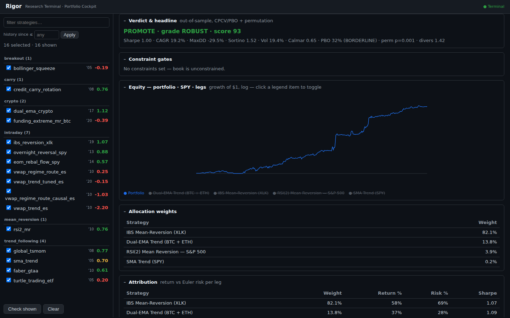

# Portfolio Cockpit

A browser tool for constructing, validating and comparing **multi-strategy
portfolios** on top of the Rigor strategy book — and saving the ones you like to the
committed `portfolios/` folder so they can be reviewed from any clone.

<p align="center"></p>

It's a clean integration: strategies are discovered from `strategies/`, every statistic
comes from `rigor.validation` / `rigor.metrics` (the same numbers as the catalog — one
validation stack), and benchmark / ETF-factor / sector data goes through the EODHD
`DataLoader` (offline-safe: it degrades gracefully without a key).

It lives in **`cockpit/`** as two importable modules — the headless
**`portfolio_engine`** (all the compute) and **`cockpit_api`** (a thin FastAPI service
over it) — plus a dependency-free HTML/CSS/JS frontend. Every number flows through
`portfolio_engine.cockpit` (`build_portfolio` / `search_portfolios`), so the API and
any other consumer can never disagree on a portfolio's numbers. (A PySide6 desktop
app preceded this; it was retired when the cockpit moved to the browser.)

---

## Install & launch

```bash
pip install -e Framework             # the rigor package (data / metrics / validation)
pip install -e "cockpit[dev]"   # the FastAPI service + portfolio_engine + deps
uvicorn cockpit_api.main:app --port 8000   # from cockpit/, then open http://localhost:8000
```

Discovery uses the repo's `strategies/` book by default (override with
`COCKPIT_STRATEGY_ROOT`). A live benchmark/factor fetch needs the EODHD key in `.env`;
without it the cockpit still builds and validates and simply notes "factor data
unavailable offline".

---

## The flow — search → candidate list → open one

1. **Pick strategies** in the left rail (filter by name; a "history since ≤ year"
   filter keeps only strategies with enough track record).
2. **Set the criteria** — min Sharpe / CAGR, max DD / vol / β / ρ, min diversification,
   max risk-per-strategy, and **cardinality** (min/max number of legs).
3. **★ Search** grid-searches the best **focused *k-of-N* subsets** of the selection
   (not a closet index spread across the whole book) and returns a **ranked, sortable**
   candidate list. Options: **CPCV** out-of-sample scoring, and a **common-window**
   backtest that scores each book only over the bars where *its own* legs overlap
   (computed per candidate, so a young strategy only shortens the books that use it).
4. **Click a candidate** to open its full **dossier**: the verdict (promotion +
   allocation PBO + permutation), constraint gates, a toggleable **equity chart**
   (portfolio / SPY / each leg), allocation weights, per-leg **attribution** (return vs
   Euler risk), **strategy-vs-portfolio metrics**, the **correlation matrix**, tail
   dependence, per-**regime** performance, historical **stress** replays, and an
   ETF-proxy **factor** regression. **Save** persists it to `portfolios/`.

The backtest combines strategies with **per-bar active-share renormalisation**: when a
leg is dormant on a bar (a monthly strategy between month-ends, a crypto strategy
before it existed), its weight is carried by the active legs so the target gross
exposure is preserved — unless you turn on the common-window mode, which instead
restricts to the overlap.

---

## Saved portfolios — the `portfolios/` standard

Saving writes one folder per portfolio, committed and visible on GitHub:

```
portfolios/<name>/
├── portfolio.json     strategies (by slug) + weights + allocation mode + metrics
└── artifacts/
    ├── <name>_returns.csv    daily portfolio returns
    ├── <name>_summary.json   metrics + beta + weights
    └── <name>_report.html    a self-contained tearsheet (equity + metrics + weights)
```

A portfolio references its strategies **by slug**, so it always rebuilds from the
current `strategies/` book. Commit the folder like you commit a strategy's artifacts;
anyone can `git pull` and open the tearsheet or reload the definition.

---

## Architecture

```
cockpit/
  portfolio_engine/     the compute (no GUI) — on rigor.metrics / rigor.validation
    cockpit.py          build pipeline: build_portfolio / build_from_weights /
                        search_portfolios (allocate → backtest → validate → gate → analyse)
    candidates.py       discover strategies/<cat>/<slug>/artifacts -> StrategyCandidate
    weight_methods.py   equal_weight / inverse_vol / risk_parity / min_variance /
                        max_sharpe / HRP / risk_budget
    allocator.py        AllocationConfig + PortfolioAllocator (+ Kelly, regime-dependent,
                        caps, vol target, DD-throttle, margin)
    selector.py         Constraints + robustness/correlation filtering
    backtester.py       per-bar active-share combination -> metrics + beta
    search.py           dense Dirichlet search + subset (k-of-N) search, walk-forward
                        or CPCV OOS, composite anti-overfit score, common-window scoring
    analysis.py         beta decomposition / capture / rolling beta+corr / significance
                        (PSR/DSR/bootstrap CI) / market regimes / Monte-Carlo / ruin /
                        efficient frontier / rebalance sweep / attribution / factor
                        regression / sector aggregation
    portfolio_validation.py  portfolio-level PBO / cardinality / permutation test
    stress.py           historical crisis replays
    risk.py             VaR / CVaR / ulcer / diversification / beta
    data.py             EODHD benchmark + ETF-proxy factors + sector (offline-safe)
    portfolio_io.py     save / load portfolios/<name>/ (matplotlib tearsheet, lazy import)
  cockpit_api/          FastAPI: main (app + static mount) + settings + schemas +
                        engine (adapter + JSON serialise) + routers (strategies, portfolio)
  frontend/             vanilla HTML/CSS/JS (no build step) — rail + search + result cards
  tests/                engine tests + FastAPI TestClient API tests (offline)
```

**Single source of truth.** Sharpe/CAGR/DD/etc. come from `rigor.metrics`; the
anti-overfit stats (PSR/DSR/PBO/permutation) from `rigor.validation`. The engine never
recomputes a metric inline.

**Not everything is surfaced.** `portfolio_engine` carries more than the cockpit UI
shows today (Monte-Carlo, ruin probability, the efficient frontier, the
rebalance-frequency sweep, the dense whole-book grid search). They're engine
capabilities ready for a future view — don't mistake them for dead code.

**Provenance.** The API *shape* follows an earlier in-house cockpit service; it is re-implemented here over `rigor`'s own engine, metrics and validation.
